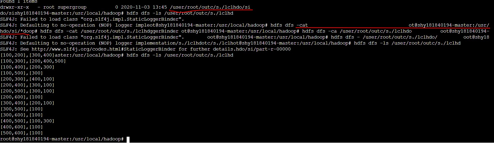

# 作业6

## 作业要求

给定一个包含上千万用户的社交网络，尝试编写MapReduce程序为所有用户对中找出“共同好友”。

即令U为包含所有用户的一个集合：{U1, U2, ….Un}，编写MapReduce程序为每个(Ui, Uj)对（i≠j）找出共同好友。假设输入记录格式如下：

```
<person><,><friend1><friend2>…<friendn>

这里<friend1><friend2>…<friendn>是<person>的好友，均用唯一的用户ID标识。

输出格式为：<([><personi,personj><]><,><[><friendx><,><friendy><,>….<friendz><])>
```
编写MapReduce程序可以尝试两种方案（1）使用基本数据类型；（2）使用自定义数据类型。

例如输入实例：

100, 200	300	400	500	600

200, 100	300	400

输出为：

([100, 200], [300, 400])

## 设计思路

总体思路：出于时间和难度的考虑，只采用了原有的数据类型，未采用自定义数据类型。
分为两个job。job1负责将输入文件中每一个被指向的friend作为key，person作为value，输出至中转文件夹。job2负责从中转文件夹中的信息中，以person对(pair)为key，对应共同好友为value，输出最终结果。

以下是job1和job2的设置：

#### job1的mapper

从输入文件中提取反向信息，将friend作为key，而指向friend的每个person作为value。

#### job1的reducer

对job1的mapper结果进行reduce之后，将一连串person用,分隔，并以text方式输出至中转文件夹。

#### job2的mapper

从中转文件夹中读取Text信息，从job1输出的value中提取每两个作为一个pair，并以每个pair作为key，friend作为value输出。

#### job2的reducer

将job2的mapper输出的结果进行统一，并按照指定格式输出。这里，对作业要求中的输出格式的完成不仅依靠job2中的mapper和reducer，也依靠自定义的OutputFormat，即后述的DotOutputFormat。

#### 自定义输出格式

这次的自定义输出格式类名叫DotOutputFormat，顾名思义，就是使用,对key和value进行分隔。这次采用了比较保守的修改方法，对TextOutputFormat的修改仅限于RecordWriter类，对其中的keyValueSeparator值直接进行修改，变为,。而不是像作业五中那样，直接修改LineRecordWriter。

这次还真的在各平台运行无误，看来作业五的离奇separator报错真的是上次做的太大胆的修改所导致的，更具体地，应该是关于一个全局变量separator的错误。吃一堑长一智，以后在从源码中继承类并做修改时也要注意谨慎。

#### 报错机制

在代码结尾处，通过两个if判断这样简单的语句，希望能在出异常时直接定位之。不过这次一切进展顺利，竟然没有用上。

## 实验结果

运行方式：hadoop jar jar包 输入路径 输出路径，不带其他参数。

运行结果：

windows上的单机成功。根据我的经验ubuntu的伪分布式应该会成功，故未试验。

bdkit上的集群成功，两个slave节点。

输出结果：这里可以注意下，我的输出文件夹名字（红线部分）很奇怪，这是由于在执行jar指令时，我的bdkit突然卡住，后来得知是与同学的终端冲突了（详见下述“思考”）。在卡住时我乱点了几个键，结果糊里糊涂地竟运行起来。所以文件夹名字如此诡异。不过因为这些错乱的按键都只是在```<output>```这个参数里，所以并未妨碍正常运行。


本次我直接尝试用依赖于hadoop3.2.1的jar包在bdkit上运行，未出现问题，最后完全成功。回想作业五中的separator错误，想必不是版本原因，而是我在别处瞎捣鼓出了问题罢。且问题应该是出在自定义的OutputFormat处，我这次用了较为保险的修改方法（上述的只修改keyValueSeparator），就没有出现任何问题。谨记这个教训。

## 思考

### 关于maven的各种玄学报错

couldn't transfer metadata https://repo.maven.apache.org/maven2/org/apache/maven/plugins/maven-archetype-plugin/maven-metadata.xml.

这是我在从archetype创建项目时出现的报错。类似这样的玄学报错在作业五就遇到了很多很多很多，多是以couldn't transfer metadata/descriptor开头，搞得我一度很心累。我这次所幸不去找各种奇葩而难行的解决方案了，直接去maven的中央仓库手动下载了archetype的jar包，放到本地仓库。结果开始了下载过程，却直接报错找不到对应的archetype了。。。于是我决定弃用archetype。遂安然无恙。

### bdkit的神秘冲突

我在bdkit运行时，突然卡了下，无法动弹。遂关闭终端，重开，顺利完成。这时看到同学消息，方知我刚刚卡的那下，是同学的终端与我冲突了。截图来自于常云杰同学。这个小冲突给我造成的麻烦已经在上面提到，这里就不赘述了。这个问题也没有办法复现，纯粹作为issue上报给老师和助教了。